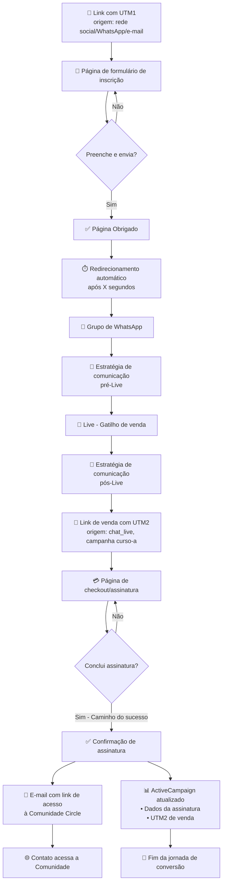
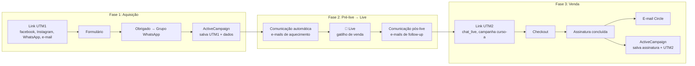
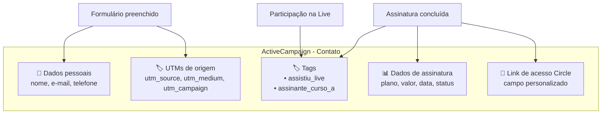
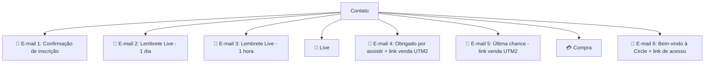
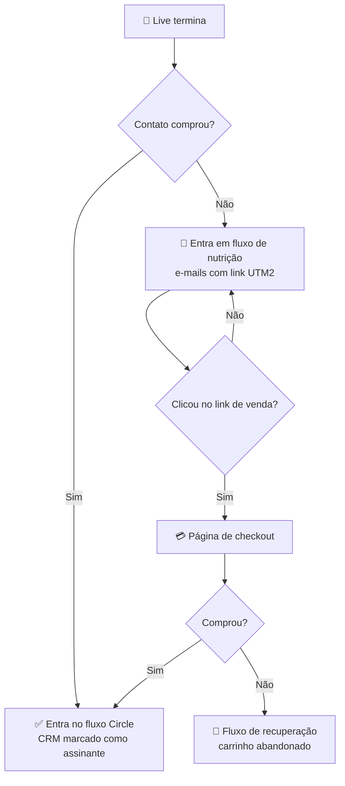

## Fluxo completo da jornada do Contato (Aluno potencial)

## Fluxo detalhado com os dois momentos de UTM

## Fluxo de dados no ActiveCampaign

## Fluxo de e-mails e comunicações

## Fluxo de decisão da Live para a Venda

